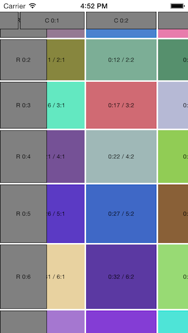

DRCollectionViewTableLayout
===========================

`UICollectionViewLayout` for displaying 2D tables, similar to those in spreadsheets. Library contains layout class and `DRCollectionViewTableLayoutManager` that acts as a proxy and allows to configure collection view, and propagate it with data in easy way. For example implementation, checkout attached demo project.

Tested under iOS 7, should work on iOS 6 (check [reported issues](../../issues?labels=iOS+6) if you are planning to support iOS 6).

Demo project is configured to display a table with column and row headers. Each cell has randomly generated color. Labels in cells contains `UICollectionView` indexPath for given cell, as well as layout's column and row number. Labels in headers contains `UICollectionView` section number, and layout's column/row number.

`DRCollectionViewTableLayout` alows you to easily setup floating headers for columns as well as rows. Sticky headers behaviour is similar to `UITableView` headers.

## Installation

You can install the library using CocoaPods. To do so, you will need to add one of the following lines to your Podfile:

For stable release (recommended):

    pod 'DRCollectionViewTableLayout', '~> 1.0.4'

Which creates dependency for version `>= 1.0.4` and `< 1.1`

For most recent or exact development version (not recommended on production):

    pod 'DRCollectionViewTableLayout', :git => 'https://github.com/darrarski/DRCollectionViewTableLayout-iOS.git', :tag => 'VERSION_TAG'
    
Where `VERSION_TAG` you should put tag name for given version (ex. "1.0.4"). It is recommended to set version explicity instead of using most recent version, as backward compatibility is not warranted.

## Usage

Public methods of the library are documented in-code. For detailed examples check out attached demo project.

## License

Code in this project is available under the MIT license.

## Credits

The library is using concepts from:

- [KEZCollectionViewTableLayout by ketzusaka](https://github.com/ketzusaka/KEZCollectionViewTableLayout)

